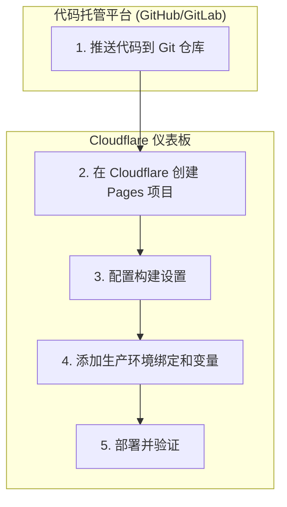

# SuperSub - 智能订阅转换与管理平台

SuperSub 是一个构建在 Cloudflare 生态系统上的全栈应用程序，旨在提供强大而灵活的代理订阅转换和管理功能。它允许用户聚合、处理和分发适用于不同客户端的定制化配置文件。

## ✨ 核心功能

- **多协议支持**：通过灵活的节点解析器，支持从各种订阅源（Base64, Clash, V2RayN 等）导入不同协议的节点。
- **订阅管理**：
    - 轻松添加、管理和更新多个远程订阅源。
    - 支持**批量导入**和**批量删除**，提升管理效率。
    - **订阅信息感知**：自动从订阅源解析并展示**剩余流量**和**到期时间**，并对临近到期或用尽的订阅进行高亮预警。
- **链接预览**：在添加订阅前，可预览任何订阅链接的内容，包括节点列表、协议和地区分布，并可选择性地将其导入为手动节点。
- **节点分组**：创建、排序和管理节点分组，使节点组织更加清晰有序。
- **高级订阅规则**：
    - **关键词过滤**：按名称关键词包含或排除节点。
    - **正则过滤**：使用正则表达式精确匹配节点。
    - **正则重命名**：基于正则表达式对节点进行批量重命名。
- **配置集 (Profile)**：强大的核心功能，允许用户将多个数据源（订阅、手动节点）组合成一个最终的、可供客户端使用的订阅链接。
- **健康检查**：监控节点状态，确保可用性。
- **用户认证**：安全的 JWT 用户认证系统。

## 核心概念：配置集 (Profile)

配置集是 SuperSub 的核心，它取代了传统的“规则”和“模板”的简单组合，提供了一个更强大和灵活的配置生成引擎。一个配置集定义了从**数据来源**到**最终输出**的完整处理流程。

- **数据源聚合**：自由组合任意数量的**订阅**和**手动节点分组**作为输入。
- **前缀管理**：为来自不同来源的节点自动添加前缀（如 `订阅名 - 节点名` 或 `分组名 - 节点名`），方便区分。
- **高级订阅处理**：
    - **轮询模式**：每次访问订阅链接时，按顺序从多个订阅源中返回一个，实现负载均衡。
    - **随机模式**：每次访问时，随机返回一个订阅源的内容。
- **在线转换**：支持对接外部 `subconverter` 服务，将聚合后的节点列表转换为特定客户端（如 Clash）所需的完整配置文件。

通过配置集，您可以轻松实现“将A、B两个订阅与我的‘私有节点’分组混合，过滤掉其中所有美国节点，然后生成一个适用于 Clash 的配置文件”这类复杂需求。

## 🚀 技术栈

- **前端**：
  - [Vue 3](https://vuejs.org/) (Composition API)
  - [Vite](https://vitejs.dev/)
  - [Naive UI](https://www.naiveui.com/)
  - [Pinia](https://pinia.vuejs.org/)
  - [Tailwind CSS](https://tailwindcss.com/)
- **后端**：
  - [Cloudflare Workers](https://workers.cloudflare.com/)
  - [Hono](https://hono.dev/)
- **数据库**：
  - [Cloudflare D1](https://developers.cloudflare.com/d1/)
- **部署**：
  - [Cloudflare Pages](https://pages.cloudflare.com/)

## 🛠️ 本地开发

### 1. 先决条件

- [Node.js](https://nodejs.org/) (>= 18.0.0)
- [npm](https://www.npmjs.com/)

### 2. 安装依赖

克隆项目后，在根目录运行：
```bash
npm install
```

### 3. 初始化数据库

首次运行时，或当数据库结构发生变化时，需要初始化本地 D1 数据库。
```bash
npm run db:init
```
如果遇到数据库相关的错误 (例如 `no such table`)，可以尝试硬重置：
```bash
# 删除旧的 Wrangler 状态 (包括 D1 数据库)
rm -rf .wrangler
# 重新初始化
npm run db:init
```

### 4. 启动开发服务

为了确保稳定，推荐在两个独立的终端中分别启动后端和前端。

**- 终端 1: 启动后端 (Wrangler)**
```bash
npm run start:backend
```
等待直到您看到 `[wrangler] Ready on http://localhost:8789` 的输出。

**- 终端 2: 启动前端 (Vite)**
```bash
npm run start:frontend
```
前端服务启动后，您可以在浏览器中访问 `http://localhost:5173`。

Vite 会自动将 `/api` 请求代理到运行在 `8789` 端口的后端服务。

## 📜 主要 NPM 脚本

- `npm run start:frontend`: 仅启动 Vite 前端开发服务器。
- `npm run start:backend`: 仅启动 Wrangler 后端开发服务器。
- `npm run db:init`: 初始化本地 D1 数据库。
- `npm run build`: 构建用于生产环境的前端应用。


## 🚀 部署到 Cloudflare Pages

该项目已完全配置为通过 Cloudflare Pages 进行一体化部署。`functions` 目录下的后端 API 将与前端应用一同部署。

### 部署流程图



### 详细步骤

1.  **准备代码仓库**:
    *   确保您的项目代码已推送到一个 Git 仓库（例如 GitHub, GitLab）。

2.  **创建 Cloudflare Pages 项目**:
    *   登录 Cloudflare 仪表板。
    *   导航到 **Workers & Pages** > **创建应用程序** > **Pages**。
    *   点击 **连接到 Git** 并授权 Cloudflare 访问您的代码仓库。

3.  **配置构建和部署**:
    *   选择您的项目仓库。
    *   在 **设置构建和部署** 页面，Cloudflare 应该会自动检测到您的框架。请确认或填写以下设置：
        *   **框架预设**: `Vite`
        *   **构建命令**: `npm run build`
        *   **构建输出目录**: `dist`
        *   **根目录**: 留空

4.  **配置兼容性标志 (重要)**:
    *   项目依赖于 Node.js 的兼容性 API。您必须在 Pages 项目中启用此功能。
    *   导航到 **设置** > **函数** > **兼容性标志**。
    *   添加并启用 `nodejs_compat` 标志。

5.  **配置生产环境绑定和变量**:
    *   项目创建后，进入 Pages 项目的 **设置** > **函数**。
    *   **D1 数据库绑定**:
        *   您需要先在 Cloudflare 仪表板的 **Workers & Pages > D1** 部分创建一个生产数据库。
        *   然后回到 Pages 设置页面，在 **D1 数据库绑定** 部分，点击 **添加绑定**。
        *   **变量名称** 必须为 `DB`。
        *   **D1 数据库** 选择您刚刚创建的生产数据库。
        *   **初始化与迁移生产数据库**:
            *   **重要**: Cloudflare 不会自动为您创建或更新数据库表结构。您需要手动执行此操作。
            *   首先，确保您的 `wrangler.toml` 文件中的 `database_name` 与您在 Cloudflare 仪表板创建的生产数据库名称一致。
            *   然后，在您的项目根目录运行以下命令。这些命令会先创建基础表结构，然后应用所有增量更新：
            ```bash
            # 1. 应用基础 Schema (仅在首次创建数据库时需要)
            npx wrangler d1 execute [您的生产数据库名称] --file=./db/schema.sql

            # 2. 应用所有迁移
            npx wrangler d1 execute [您的生产数据库名称] --file=./migrations/0001_update_ua_mappings.sql
            npx wrangler d1 execute [您的生产数据库名称] --file=./migrations/0002_add_sub_info.sql
            # ... 如果有更多迁移文件，请继续在这里添加 ...
            ```
            *   **注意**: 请将 `[您的生产数据库名称]` 替换为您在 Cloudflare 上创建的真实数据库名称。
            *   在项目后续的更新中，如果 `migrations` 目录新增了文件，您只需执行新增的迁移命令即可。
    *   **环境变量**:
        *   导航到 **设置** > **环境变量**。
        *   添加生产环境所需的环境变量。最重要的是 `JWT_SECRET`。
        *   **强烈建议**为 `JWT_SECRET` 设置一个长而随机的安全字符串，**不要使用本地开发时的默认值**。

6.  **部署**:
    *   保存您的配置。Cloudflare 将自动开始第一次部署。
    *   后续每次推送到您的 Git 仓库主分支时，Cloudflare 都会自动重新构建和部署您的应用。
    *   部署成功后，即可通过 `*.pages.dev` 域名访问您的 SuperSub 实例。
