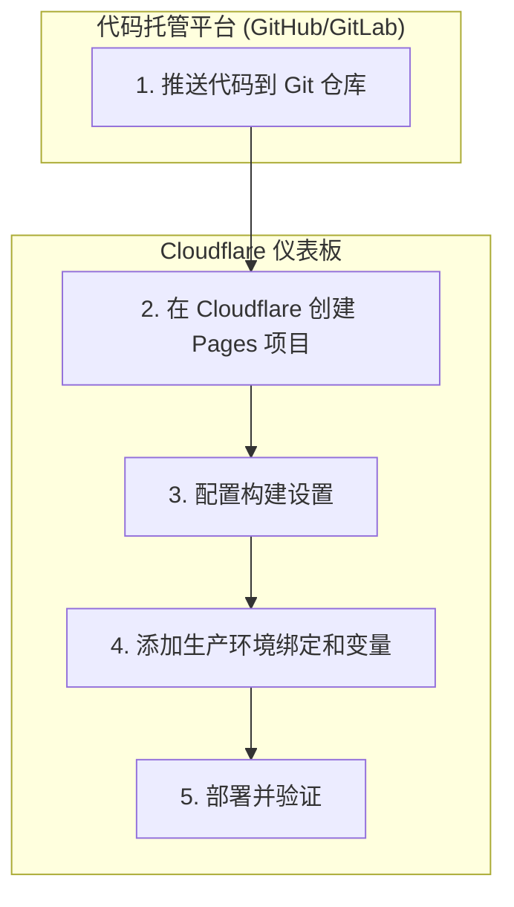

# SuperSub - 智能订阅转换与管理平台

SuperSub 是一个构建在 Cloudflare 生态系统上的全栈应用程序，旨在提供强大而灵活的代理订阅转换和管理功能。它允许用户聚合、处理和分发适用于不同客户端的定制化配置文件。

## ✨ 核心功能

- **多协议支持**：通过灵活的节点解析器，支持从各种订阅源导入不同协议的节点。
- **订阅管理**：轻松添加、管理和更新多个远程订阅源。
- **节点分组**：创建、排序和管理节点分组，使节点组织更加清晰有序。
- **增强的节点操作**：支持对分组进行一键去重、排序，并可拖拽排序单个节点。
- **规则驱动的转换**：创建和管理订阅规则，以过滤、排序和重命名节点。
- **可定制的配置模板**：为不同的代理客户端（如 Clash）创建和管理输出模板。
- **流水线处理**：将订阅、规则和模板组合成强大的处理流水线，生成最终的客户端配置文件。
- **健康检查**：监控节点状态，确保可用性。
- **用户认证**：安全的 JWT 用户认证系统。

## 🚀 技术栈

- **前端**：
  - [Vue 3](https://vuejs.org/) (Composition API)
  - [Vite](https://vitejs.dev/)
  - [Naive UI](https://www.naiveui.com/)
  - [Pinia](https://pinia.vuejs.org/)
  - [Tailwind CSS](https://tailwindcss.com/)
- **后端**：
  - [Cloudflare Workers](https://workers.cloudflare.com/)
  - [Hono](https://hono.dev/)
- **数据库**：
  - [Cloudflare D1](https://developers.cloudflare.com/d1/)
- **部署**：
  - [Cloudflare Pages](https://pages.cloudflare.com/)

## 🛠️ 本地开发

### 1. 先决条件

- [Node.js](https://nodejs.org/) (>= 18.0.0)
- [npm](https://www.npmjs.com/)

### 2. 安装依赖

克隆项目后，在根目录运行：
```bash
npm install
```

### 3. 初始化数据库

首次运行时，或当数据库结构发生变化时，需要初始化本地 D1 数据库。
```bash
npm run db:init
```
如果遇到数据库相关的错误 (例如 `no such table`)，可以尝试硬重置：
```bash
# 删除旧的 Wrangler 状态 (包括 D1 数据库)
rm -rf .wrangler
# 重新初始化
npm run db:init
```

### 4. 启动开发服务

为了确保稳定，推荐在两个独立的终端中分别启动后端和前端。

**- 终端 1: 启动后端 (Wrangler)**
```bash
npm run start:backend
```
等待直到您看到 `[wrangler] Ready on http://localhost:8789` 的输出。

**- 终端 2: 启动前端 (Vite)**
```bash
npm run start:frontend
```
前端服务启动后，您可以在浏览器中访问 `http://localhost:5173`。

Vite 会自动将 `/api` 请求代理到运行在 `8789` 端口的后端服务。

## 📜 主要 NPM 脚本

- `npm run start:frontend`: 仅启动 Vite 前端开发服务器。
- `npm run start:backend`: 仅启动 Wrangler 后端开发服务器。
- `npm run db:init`: 初始化本地 D1 数据库。
- `npm run build`: 构建用于生产环境的前端应用。


## 🚀 部署到 Cloudflare Pages

该项目已完全配置为通过 Cloudflare Pages 进行一体化部署。`functions` 目录下的后端 API 将与前端应用一同部署。

### 部署流程图



### 详细步骤

1.  **准备代码仓库**:
    *   确保您的项目代码已推送到一个 Git 仓库（例如 GitHub, GitLab）。

2.  **创建 Cloudflare Pages 项目**:
    *   登录 Cloudflare 仪表板。
    *   导航到 **Workers & Pages** > **创建应用程序** > **Pages**。
    *   点击 **连接到 Git** 并授权 Cloudflare 访问您的代码仓库。

3.  **配置构建和部署**:
    *   选择您的项目仓库。
    *   在 **设置构建和部署** 页面，Cloudflare 应该会自动检测到您的框架。请确认或填写以下设置：
        *   **框架预设**: `Vite`
        *   **构建命令**: `npm run build`
        *   **构建输出目录**: `dist`
        *   **根目录**: 留空

4.  **配置生产环境绑定和变量**:
    *   项目创建后，进入 Pages 项目的 **设置** > **函数**。
    *   **D1 数据库绑定**:
        *   您需要先在 Cloudflare 仪表板的 **Workers & Pages > D1** 部分创建一个生产数据库。
        *   然后回到 Pages 设置页面，在 **D1 数据库绑定** 部分，点击 **添加绑定**。
        *   **变量名称** 必须为 `DB`。
        *   **D1 数据库** 选择您刚刚创建的生产数据库。
    *   **环境变量**:
        *   导航到 **设置** > **环境变量**。
        *   添加生产环境所需的环境变量。最重要的是 `JWT_SECRET`。
        *   **强烈建议**为 `JWT_SECRET` 设置一个长而随机的安全字符串，**不要使用本地开发时的默认值**。

5.  **部署**:
    *   保存您的配置。Cloudflare 将自动开始第一次部署。
    *   后续每次推送到您的 Git 仓库主分支时，Cloudflare 都会自动重新构建和部署您的应用。
    *   部署成功后，即可通过 `*.pages.dev` 域名访问您的 SuperSub 实例。
